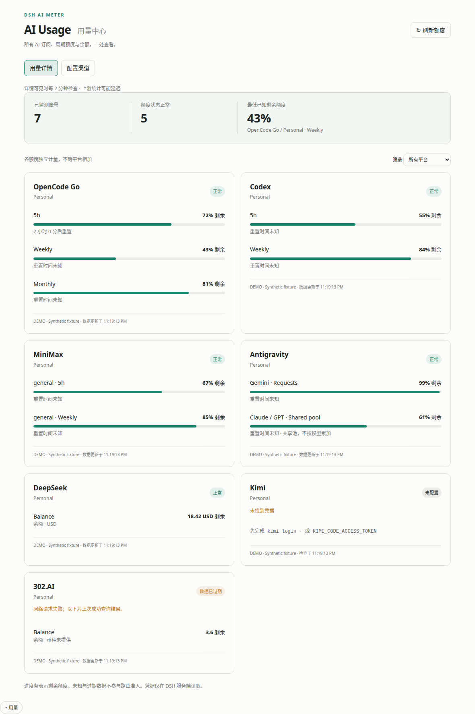
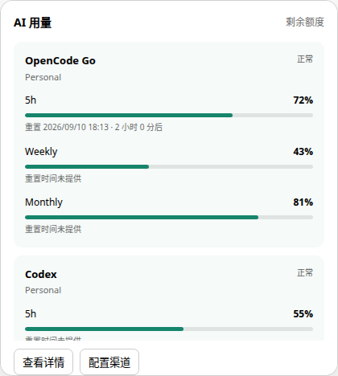
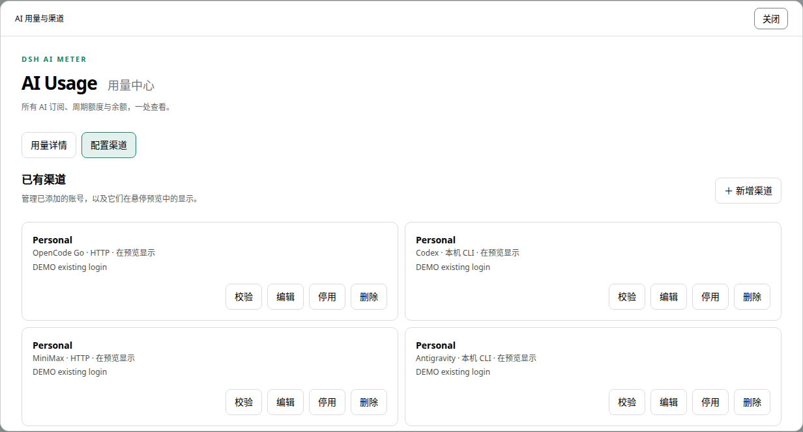

# DSH AI Meter

**简体中文** | [English](README.en.md)

Unified AI provider usage, quota and balance monitor for DeepSeek Harness.

为 DeepSeek Harness 提供统一 AI 用量中心：订阅周期额度、共享模型池、请求数、credits 和余额独立展示，不把所有平台压成一个 `usage_percent`。

**状态：v0.1.0 开发预览，尚未发布 npm。** 已实现八个平台的 adapter、DSH 服务/RPC、Agent 工具及用量与渠道配置界面。自动测试使用合成响应；已在实际 DSH Web 中验证集成，并核对多个官方 CLI 的真实输出。每个渠道仍需在自己的执行机器上完成登录与连接校验；支持某个平台不代表所有套餐和接口格式均已覆盖。



截图为合成数据示意，可能落后于当前界面；不含真实账号额度。

## 功能与支持平台

| Provider | 已实现 | 凭据 / 前置条件 |
| --- | --- | --- |
| OpenCode Go | rolling / weekly / monthly 剩余比例、reset | `OPENCODE_GO_API_KEY`，或本机 OpenCode `opencode-go` 登录条目 |
| 火山方舟 | Agent Plan / Coding Plan（个人、团队）的周期额度与重置时间 | 官方 `arkcli usage plan`，本机 / SSH，自有登录与可选 profile |
| MiniMax | Token Plan 的当前周期 / weekly、boost；旧 Coding Plan 请求额度 | 官方 `mmx quota show`（本机 / SSH）或 `MINIMAX_API_KEY` HTTP；支持无限额度与套餐未包含状态 |
| Codex | app-server 返回的各 limit bucket、周期、credits | `codex` 在服务端 PATH 中，且已通过 ChatGPT 登录 |
| Antigravity | Gemini / Claude-GPT 的 5h、weekly、reset | 官方 `agy --print /usage`，使用 CLI 自有登录 |
| Kimi | Coding 短周期与 weekly | 本机 Kimi Code 登录态，或 `KIMI_CODE_ACCESS_TOKEN` |
| DeepSeek | 各币种 API balance | `DEEPSEEK_API_KEY` |
| 302.AI | balance，未提供币种时保留未知 | `AI_302_API_KEY` |

- Settings → **AI Usage · 用量**：逐账号卡片、剩余进度条、重置倒计时、最低已知额度、筛选、刷新，以及可编辑的渠道与账号配置。
- Agent 工具 **`query_ai_quota`**：结构化返回各账号的独立 meter 和采集状态。
- 对话输入框旁常驻 **AI 用量** 按钮，悬停/键盘聚焦展示总体预览，点击打开分为“用量详情 / 配置渠道”的大面板；触屏可直接点击。
- 多账号：每个平台可配置多组凭据名称或本地 CLI 位置，按 Provider + account 隔离缓存。
- HTTP 默认缓存 2 分钟，CLI/SSH 默认 5 分钟，渠道可覆盖；并发刷新合并、最多 3 个采集任务同时执行；界面逐渠道显示结果。失败后保留旧值并标记 `stale`。
- `getAvailableProviders()` 返回通过保守额度检查的账号；不自动选择模型。

## 本地开发与安装

需要 Node.js 22+、npm，以及已安装的 DSH / pnpm。

客户端显式依赖 `dsh-client-ui-renderer`，不依赖已移除的 `dsh-client-runtime`；用于 DSH 0.1.5 的插件加载。

```sh
npm ci
npm run check
npm pack
```

将已构建的包安装到你的 DSH Web profile（路径替换为实际路径）：

```sh
dsh plugin --profile web add /absolute/path/dsh-ai-meter/dsh-ai-meter-0.1.0.tgz
```

重启 `dsh web`，打开 Settings → AI Usage。开发时也可在构建后使用本地目录：

```sh
dsh plugin --profile web add /absolute/path/dsh-ai-meter
```

仓库发布代码后可用 `dsh plugin --profile web add github:percyc/dsh-ai-meter#<commit>`。本项目提供 `prepare` 构建脚本；pnpm 如要求允许依赖构建，请按 DSH 输出在对应 profile 的 `pnpm-workspace.yaml` 添加准确的 `allowBuilds` 条目。安装预构建 `.tgz` 无需构建步骤。参见 [DSH 官方插件发布说明](https://github.com/deepseek-ai/deepseek-harness/blob/master/docs/user/develop/basic/publish.md)。

## 可选：多个本地插件一起重载

仓库提供 [reload-dsh.py](scripts/reload-dsh.py) 和 [配置模板](scripts/reload-dsh.example.json)，需按实际 DSH 路径与插件清单安装配置，并非安装插件后自动可用。配置完成后，用 `reload-dsh --list` 查看，`reload-dsh --plugins ai-meter` 重载，`--enable/--disable` 增量选择，`--dry-run` 预览。多个插件可用逗号分隔；脚本记住上次成功选择，没有必须一起加载的其他插件。详见 [注册与多插件重载](docs/RELOAD_DSH.md)。

日常启动用 `reload-dsh start`，只重启用 `reload-dsh restart`，查看当前登录链接用 `reload-dsh login`；这些操作不构建插件。`reload-dsh --help` 提供中文说明，默认可配置藏知、AI Meter 与 better-sidebar 三个插件。

## 配置

主页只展示可用来源或已显式配置的渠道，不为缺少来源的平台保留空卡片。火山方舟必须主动添加渠道；其他平台兼容既有默认来源。API 凭据先从 DSH credentials 服务解析，再回退到 DSH **服务进程**的环境变量。读取接口不返回已存 Key，浏览器也不直接请求 Provider。配置表单中的新 Key 仅通过已认证的 DSH RPC 写入服务端，不回显、不写入浏览器持久存储。

在 **AI Usage → 配置渠道** 中添加/移除账号、修改名称，MiniMax 可选择区域和套餐接口。在“连接配置”填写凭据后点击“保存并验证连接”，页面会按顺序保存渠道、保存新凭据并查询。页面显示当前凭据来源；新录入的密钥保存在 DSH 凭据服务的 `DSH_AI_METER_<hash>` 独立引用，不覆盖共享 Key 或 CLI 登录文件。账号配置存入 DSH settings 的 `dsh-ai-meter` 命名空间，保存后生效。移除账号不删除凭据。Codex/AGY/mmx/arkcli 登录需在执行机器完成；页面可配置本地/SSH 位置、CLI 路径与 home。暂不支持任意中转 Base URL。

无需把 Key 写进仓库或配置 YAML。设置上表环境变量，或在 DSH 凭据管理中存入同名凭据后，通过本机来源发现添加并校验渠道。本地来源读取运行 DSH 的机器；远端 CLI 必须显式配置 SSH 渠道，不会自动扫描其他电脑。

插件 row id 为 `ai-meter`。在 DSH 对该 row 的 `config` 中设置以下字段（此处为配置对象，不是整份 patch 文件）：

```yaml
cacheTtlMs: 120000        # 1000–3600000
timeoutMs: 15000        # 100–60000，单账号采集 deadline
lowQuotaPercent: 10      # 剩余低于该值时不进入路由候选
accounts:
  opencode-go:
    - id: personal
      name: Personal
      credentialEnv: OPENCODE_GO_API_KEY
    - id: work
      name: Work
      credentialEnv: WORK_OPENCODE_GO_KEY
  minimax:
    - id: cn
      name: 国内 Token Plan
      credentialEnv: MINIMAX_CN_KEY
      region: cn         # global（默认）或 cn
      planType: token    # token（默认）或 coding（旧版）
  codex:
    - id: personal
      query: {kind: cli, location: local}
      # query.home 为 CODEX_HOME，不是用户 HOME
  antigravity:
    - id: local
      query: {kind: cli, location: local}
  kimi:
    - id: local
  deepseek:
    - id: personal
      credentialEnv: DEEPSEEK_API_KEY
  volcengine:
    - id: coding
      name: 火山 Coding Plan
      query: {kind: cli, location: local}
      arkProfile: my-profile   # 可选；留空使用 CLI 当前 profile
      arkProduct: coding-plan # 可选；留空自动发现订阅
      presentation: {visible: false}
  302ai: []              # [] 禁用该平台；省略则兼容默认账号（火山除外）
```

`id` 在单个平台内唯一。账号配置一旦指定便替换该平台默认账号列表。

- `credentialEnv` 是凭据名称，**不是 Key 本身**。显式配置后不再回退读取其他本地登录文件。
- OpenCode：默认读取 `$XDG_DATA_HOME/opencode/auth.json` 或 `~/.local/share/opencode/auth.json` 的 `opencode-go` API 条目，不混用普通 OpenCode Key。
- Kimi：读取 `~/.kimi-code/credentials/kimi-code.json`，兼容 `~/.kimi/credentials/kimi-code.json`。v0.1 不修改登录文件、不轮换 token；过期后运行 `kimi login`。
- `home`：Codex 表示独立的 `CODEX_HOME`；OpenCode / Kimi 表示用于本机文件查找的用户目录；AGY 表示传给 CLI 的 HOME / USERPROFILE，但不能替代 OS keyring 用户切换。
- CLI 路径优先使用 `query.executable`，登录目录优先使用 `query.home`。Codex 兼容旧 `command/args/home`；AGY、mmx、arkcli 使用固定额度命令，不支持额外 args。SSH 路径可自动查找，详见下文。
- AGY/mmx/arkcli 的 home 是执行机器的 HOME / USERPROFILE，Codex 是 CODEX_HOME；这些设置不能替代系统用户或 OS keyring 切换。CLI 自己管理登录和认证刷新，插件不复制远端凭据。
- 收起时无采集轮询；悬停按需查缓存，详情页可见时按渠道到期时间检查，配置页和后台标签页暂停。详见下节刷新策略。



### 预览与详情窗口

悬停预览合并平台与渠道标题，正常状态用圆点表示，异常保留文字。每项指标以名称、细进度条、剩余值、简短重置日期紧凑排列；当日显示时间，其他日期显示月/日，鼠标悬停或键盘聚焦可查看完整日期与倒计时。窄屏日期换行；过期数据使用灰色条。额外 credits 与未包含指标默认隐藏，显式选择可展示。各渠道显示最近成功采集时间，不新增后台定时采集。

详情/配置使用原生模态窗口，桌面最大宽度 1440px、高度约 92% 视口，窄屏保留边距。窗口打开时背景控件不可交互，避免宿主对话区的调节条覆盖窗口；支持 Escape、关闭按钮和点击遮罩关闭，关闭后恢复焦点与页面滚动。

## 渠道、查询来源与预览映射

主页详情和悬停预览不展示未配置（缺少凭据或 CLI）的渠道；查询失败、登录过期、额度耗尽和保留的过期数据仍展示状态。显式保存的渠道即使缺少凭据也保留在配置列表，便于修复。兼容旧配置时，未找到任何来源的平台不会凭空列为已有渠道。

配置入口：点击“用量”→ **配置渠道**。每个渠道是一条独立来源，例如“本机 Codex”“工作站 Codex”“个人 DeepSeek”。现有默认渠道兼容保留；新加渠道默认不加入悬停预览，需要明确勾选。



### 两层配置

| 设置 | 行为 |
| --- | --- |
| 启用采集 | 关闭后不参与预览、全量详情或 Agent 查询；配置及凭据保留 |
| 加入悬停预览 | 关闭后悬停不会查询此渠道，已启用渠道仍可从完整详情 / Agent 查询 |
| 显示名称 | 区分本地、不同 SSH 主机、不同账号；渠道 ID 保持不变 |
| 账号归属标记 | 可给同一账号的不同来源填写相同标记；仅说明关联，不自动合并、去重或故障切换 |
| 渠道排序 | 小值在预览中靠前 |
| 指标范围 | 默认指标（排除额外 credits 和套餐未包含指标，包含以后新增的普通指标），或仅选择的指标（不自动加入新指标） |
| 指标别名和顺序 | 只改变预览中的名称与顺序，详情保留原始名称和全部指标 |

配置入口先显示**已有渠道列表**，可以直接校验、编辑、启用、停用或删除。校验仅对该账号发起一次跳过缓存的查询，在当前行显示结果和时间，不启动轮询；停用渠道需先启用才能校验。删除在当前行确认，移除渠道及展示配置，保留凭据；失败时列表保留原渠道。编辑默认打开连接配置，可自由切换账号设置、查询结果和预览内容；“新增渠道”先选择平台，再进入配置流程。新增配置分为四步：**选择渠道 → 连接配置 → 查询结果 → 预览内容**。第二步点击“保存并验证连接”，同时完成渠道保存、可选凭据保存与单渠道重新查询（跳过缓存）；第三步明确显示成功或失败原因；第四步直接勾选指标并“保存显示设置”。高级路径、命令和字段说明默认折叠。例如只勾选 OpenCode 的 `rolling`、`monthly`，Weekly 将不会出现在悬停预览，详情仍保留 Weekly。

“发现本机来源”仅检查默认凭据/登录文件或 CLI 命令是否存在，不访问额度接口、不验证登录有效性，也不自动创建渠道。只有点击候选的添加按钮并保存，才成为渠道；检测到 CLI 不等于已登录。默认本地发现不扫描 SSH 主机。

配置页在“查看查询方法与凭据来源”中显示实际 GET 地址或 CLI 查询协议；已保存的服务端自定义 command/home 也会反映在说明中，预设 args 的值不回显。指标列表逐项显示 ID、来源字段和换算规则。尚未查询时可修改既有选择；上游没返回某个已选指标时，预览标注“待返回”，不会自动用另一个指标替换。

多数接口一次返回全部窗口，隐藏 Weekly 通常不会减少同一账号的单次上游请求开销。只有隐藏整个预览渠道或停止采集，才会减少相应场景的账号查询。展示设置不改变 `getAvailableProviders()` 的检查：路由仍使用原始完整指标。

### 用 curl 手动验证 HTTP 渠道

“连接配置 → 查看查询方法与凭据来源”和“查询结果 → 查看本次查询方法”均提供可复制的 curl。地址会跟随平台、MiniMax 区域及套餐选择变化，与 adapter 共用同一 endpoint 定义。示例只引用 `AI_METER_TOKEN` 环境变量，**不会填入或复制已保存的真实密钥**；该变量需在运行命令的终端自行设置，命令不会自动读取 DSH 凭据服务或本机登录文件。

例如 OpenCode Go：

```sh
curl --request GET --silent --show-error --fail-with-body --max-time 15 \
  'https://opencode.ai/zen/go/v1/usage' \
  --header "Authorization: Bearer ${AI_METER_TOKEN}" \
  --header 'Accept: application/json'
```

返回原始 JSON，可对照下文的字段取值规则。HTTP 错误会显示响应正文并返回非零退出码；不跟随重定向。若在自己的电脑执行，网络环境可能与 DSH 服务端不同。CLI 渠道仍显示 CLI 协议说明，不生成 HTTP 示例。

### 支持的查询模板

| 平台 | 当前可用模板 | 认证位置 |
| --- | --- | --- |
| 火山方舟 | 官方 `arkcli usage plan`（本机 / SSH） | CLI 自有登录及可选 profile / 套餐 |
| Codex | 本地 CLI、SSH CLI | 执行机器上 Codex 自有登录 |
| Antigravity | 本地 CLI、SSH CLI | 官方 agy 自有登录 |
| MiniMax | 官方 `mmx quota show`（本机 / SSH）或 HTTP | CLI 自有登录、区域与套餐配置；HTTP 使用 DSH 凭据 |
| OpenCode Go、Kimi、DeepSeek、302.AI | HTTP 接口，复用已有凭据或独立 Key / Access Token | DSH 服务端凭据服务；OpenCode / Kimi 可复用本地登录文件 |

**Cookie 查询尚未验证，不提供可配置选项。** OpenCode Go 当前只有 HTTP 查询（使用 Key 或兼容已有本机登录凭据），没有 CLI 订阅额度查询方式；`opencode stats` 的使用统计不代表 Go 订阅剩余额度。 不把 Bearer 接口直接改成 Cookie 鉴权，不承诺每个平台都支持全部模板。HTTP 查询目前在 DSH 本机执行；SSH 目前只运行 Codex、AGY、mmx、arkcli 四种已支持的 CLI 协议，不通过 SSH 转发任意 HTTP 请求，也不提供自由 shell 脚本配置。

新增 HTTP 渠道默认采用“本渠道 API Key / Access Token”，没有保存该渠道的凭据时显示未配置，不自动借用同平台默认 Key。明确选择“复用已有凭据”或从本地发现中添加，才会使用原有凭据解析逻辑。保存新凭据后自动选用独立 Key 模式。

### SSH CLI

在 Codex / Antigravity / MiniMax CLI / 火山方舟渠道选择“SSH 远端”，填写 DSH 服务端可用的 SSH 别名或 `user@host`，例如 `workstation`。可选填写远端 CLI 可执行文件和 home；Codex 的 home 是 `CODEX_HOME`，AGY / mmx / arkcli 的 home 是远端 `HOME`。

认证复用 DSH 进程可访问的 SSH 配置、密钥文件或 agent；不在网页保存 SSH 密码或私钥。需事先完成主机密钥信任和远端 CLI 登录。远端命令通过非交互 POSIX shell 执行；可执行文件留空时会自动查找 PATH 和常见安装位置，失败后可填写绝对路径。可在 DSH 服务端自行验证：

```sh
ssh -T -o BatchMode=yes -o StrictHostKeyChecking=yes workstation 'command -v codex'
ssh -T -o BatchMode=yes -o StrictHostKeyChecking=yes workstation 'command -v agy'
```

实际传输为 `ssh -T -a -x`，使用 `BatchMode=yes`、`StrictHostKeyChecking=yes`、8 秒连接超时、保活、`ClearAllForwardings=yes` 和 `RemoteCommand=none`。不自动接受未知主机密钥、不请求终端、不启用 agent/X11 转发。远端命令逐参数进行 POSIX 引号处理；本地进程不经过 shell。业务查询仍受每账号 deadline 限制。

Codex 通过 SSH 的 stdin/stdout 完成 `initialize → initialized → account/rateLimits/read`，AGY 读取 官方 `agy --print /usage` 的文本输出。只返回查询结果，插件不读取或复制远端凭据。CLI 内部可能按自身逻辑刷新认证。SSH 失败、命令不存在或登录过期不会退回查询本机账号。

SSH 的离线测试覆盖非交互参数、命令转义、Codex 逐行协议、AGY 制表符文本及 mmx/arkcli JSON 返回；这不等于验证了某台实际远端机器。真实连通性、CLI 路径、登录和返回格式需在目标渠道首次查询时确认。

### SSH 自动查找 CLI

SSH 渠道的“CLI 可执行文件”留空时，先使用远端非交互 PATH；找不到命令时，启动远端登录 Shell，仅取得其 PATH，然后执行 CLI。如果仍找不到，再检查 `~/.local/bin`、`~/bin`、`~/.npm-global/bin`、`/home/linuxbrew/.linuxbrew/bin` 和 `/opt/homebrew/bin`。无需为查路径启动交互式 Shell。这覆盖通过登录配置加载的 Homebrew、nvm 等安装位置，同时让 Node 等解释器可被找到。登录脚本的输出不会混入额度协议；探测不读取 stdin、不主动启动登录认证。

手动填写路径时严格使用该路径，不尝试替换；自动查找失败时仍可填写绝对路径。远端登录配置需要能非交互运行，所有探测都包含在单次查询的超时内。不会写入远端 shell 配置。

### 配置示例与指标 ID

以下属于原有 `accounts` 下的账号字段，`credentialEnv` 仍可使用；旧 CLI 字段的兼容范围见上文。显式 `query.executable` / `query.home` 优先于旧字段。

```yaml
accounts:
  codex:
    - id: workstation
      name: 工作站 Codex
      enabled: true
      identity: personal-codex
      query:
        kind: cli
        location: ssh
        sshHost: workstation
        executable: /usr/local/bin/codex
        home: /home/me/.codex
      presentation:
        visible: true
        order: 10
        # ID 以“查询结果”的实际返回为准
        meterIds: [codex-primary]
        labels:
          codex-primary: 短期额度
  opencode-go:
    - id: local
      name: 本机 OpenCode
      query: {kind: http, auth: auto}
      presentation:
        visible: true
        order: 0
        meterIds: [rolling, monthly]
        labels: {rolling: 5 小时, monthly: 本月}
```

省略 `presentation` 时保留既有预览行为。省略 `meterIds` 表示默认指标（排除额外 credits 和套餐未包含指标）；显式勾选仍可展示这些指标，`meterIds: []` 表示不展示任何指标，也不会由悬停触发该渠道查询。改变展示选项和账号归属标记不会清空服务端采集缓存；改变查询来源、名称或启用状态会重新建立采集配置。

指标 ID 优先基于上游语义身份：OpenCode 窗口名、Codex limit ID + primary/secondary、MiniMax model_name + 周期、DeepSeek 币种、Kimi 窗口单位/时长、AGY 模型/额度类型或池 scope、火山方舟 product + 周期。上游缺失身份时仍有兜底 ID；上游修改身份后旧选择会显示缺失，需要人工重新选择，不能保证任意协议变化下 ID 不变。

## 刷新策略与资源开销

- **收起状态**：没有后台采集定时器。仅启动 DSH 或打开普通聊天页面不查额度。Agent 调用额度工具、用户点击校验仍可主动触发查询。
- **悬停或键盘聚焦**：只查询启用且加入预览、未选择空指标列表的渠道。先返回缓存，过期或缺失时启动查询；有进行中的任务时，界面每秒读取其状态，逐个展示完成结果。这是读取同一批任务，服务端会合并相同账号的查询，不是每秒执行一次 CLI。任务完成后停止检查；一直停留到缓存过期也不会自动再采集，重新移入才检查。
- **详情页**：打开时检查一次；保持可见时根据各渠道 `nextCheckAt` 安排下一次检查，只有到期渠道实际采集。标签页隐藏、切到配置页、关闭详情后停止定时检查。返回前台检查一次。已发起（包括排队）的查询会完成，不会因此启动新的定时采集。
- **周期**：HTTP 默认 120 秒；CLI/SSH 默认 300 秒。编辑渠道 → 连接配置 → 刷新周期，可选自动或 30 秒至 1 小时；配置字段 `refreshIntervalSeconds` 可在该范围内指定整数。全局 `cacheTtlMs` 控制 HTTP 默认值，CLI 默认独立为 5 分钟。若有效重置时间更早，正在查看详情时会提前检查；不会自行将额度补满。
- **缓存位置**：浏览器插件实例内存保存最近结果和 15 秒防重复缓存，有任务进行或到达检查时间时不受该短缓存阻挡；服务端进程内存按 Provider + account 保存数据和在途任务。同一 DSH 实例的不同浏览器共享服务端缓存；不同 DSH 实例不共享。两层均不写磁盘，页面刷新 / 服务重启分别清除对应缓存。
- **手动刷新与校验**：详情刷新绕过缓存，对全部启用渠道采集；渠道校验只采集一个账号，并清理浏览器用量缓存，返回预览/详情即可取得新结果。相同账号的并发请求仍合并。
- **并发与超时**：最多 3 个采集任务同时执行（HTTP、CLI、SSH 共用队列），其余排队；每账号超时从实际取得执行名额后开始。UI 不等待整批完成，不会被慢 SSH 阻塞显示。Agent 的完整查询 RPC 仍等待整批结果。
- **失败退避**：不在 HTTP 层立即重试。首次失败等待一个渠道周期，连续失败翻倍，最多 30 分钟；退避期间只复用错误/旧数据。成功后恢复正常周期，手动校验/刷新可跳过退避。RPC 连接失败时详情 30 秒后再试，预览不持续重试。
- **时间含义**：`fetchedAt` 是最近成功采集时间，`checkedAt` 是最近尝试时间；无成功数据时明确显示“尚无成功数据”。`expiresAt` 控制数据新鲜度；`nextCheckAt` 控制下次采集/失败重试时间；`pending` 表示已发起、尚未完成的任务。失败仍显示旧值并标注“更新失败，显示旧数据”。

持续打开详情、无额外调用或手动强刷时，默认单个 HTTP 渠道约每小时 30 次采集，单个 CLI/SSH 渠道约 12 次；实际受查询耗时、失败退避和重置边界影响。这是采集次数估算，未测量 CPU / 内存 / 流量；CLI 自身可能发起多个认证和用量请求。关闭所有用量界面后为零自动定时采集。


## 各平台取值方法与字段明细

以下描述的是**当前 adapter 实现**，便于对照代码排查；不代表所有上游接口都有稳定公开契约。完整外部参考见 [SOURCES.md](docs/SOURCES.md)。每次采集均在 DSH 服务端执行，不在浏览器调用厂商 API。

### 公共鉴权与数据处理

1. 独立 Key 模式且未配置引用时直接报告未配置。其他情况下，账号指定 `credentialEnv` 时以该引用为准，否则使用平台默认引用名。
2. 先调用 `ctx.credentials.resolve(ref)`。当前 DSH 本地凭据服务优先级是：继承的进程环境变量 → DSH `.credentials.yaml` → 启动目录 `.env` → DSH home `.env`。插件再以 `process.env[ref]` 兜底。具体来源由配置页通过 `describe` 展示。
3. OpenCode Go / Kimi 仅在**未显式指定引用且引用未取到值**时读取下述本地登录文件。Codex / AGY / mmx / arkcli 则由各自 CLI 管理认证。
4. 五个直接 HTTP adapter 均发送 `GET`，请求头是 `Authorization: Bearer <服务端解析的凭据>` 和 `Accept: application/json`，无请求体。固定域名，不跟随重定向。每个账号默认 15 秒 deadline，HTTP 响应和 CLI 输出限制为 2 MiB；AGY 命令自身另有 30 秒上限，实际取较早的超时。
5. 数字及有限的数字字符串可解析；缺失/非法值保留未知，不替换为 0 或 100%。时间支持日期字符串与 Unix 时间戳：数值小于 `1e12` 按秒，否则按毫秒，统一输出 ISO 时间。
6. 已有 `remainingPercent` 优先保留；否则仅当有剩余值和正总额时计算 `remaining / limit × 100`，派生百分比限制到 0–100。只有已用和总额时先计算 `max(0, limit - used)`。不同币种、账号、周期与池不相加；没有总额的余额不计算百分比。
7. `401/403` 标记凭据错误，`429` 标记限流；网络、超时、业务失败、格式变化分别标记。错误不等于额度耗尽。`fetchedAt` 为数据采集时间，`checkedAt` 为最近尝试时间；失败保留旧数据时不会更新旧数据的 `fetchedAt`。过了 reset 时间也不擅自补满。

实现：[shared.ts](src/providers/shared.ts)、[normalize.ts](src/core/normalize.ts)、[registry.ts](src/core/registry.ts)。

### OpenCode Go

- 默认引用：`OPENCODE_GO_API_KEY`。本地回退读取 `$XDG_DATA_HOME/opencode/auth.json`，未设置 XDG 时为 `~/.local/share/opencode/auth.json`；只接受 `opencode-go` 条目的 `type: "api"` 和 `key`。账号设置 `home` 时使用该目录下 `.local/share/opencode/auth.json`。
- 请求：`GET https://opencode.ai/zen/go/v1/usage`。
- 从响应 `usage` 对象读取；没有 `usage` 时兼容顶层字段。

| 上游字段 | 展示与换算 |
| --- | --- |
| `rolling.percent` | 5h **已用**比例，剩余为 `100 - percent` |
| `weekly.percent` | Weekly 剩余为 `100 - percent` |
| `monthly.percent` | Monthly 剩余为 `100 - percent` |
| 各窗口 `resetsAt` | 该窗口重置时间 |
| 顶层 `plan` | 套餐名称 |

不把周期额度硬编码成美元总额；当前接口解析只展示百分比。例如合成值 `weekly.percent = 57` 对应 **43% 剩余**。实现：[opencode-go.ts](src/providers/opencode-go.ts)。

### 火山方舟（Volcengine ARK）

Provider ID：`volcengine`。使用官方 arkcli，已用本机 **1.0.26** 核对真实 Coding Plan 输出。支持本机或 SSH 执行；添加渠道选择「火山方舟 → 使用官方 arkcli」。不会因为安装了 CLI 就自动加入显示。

```sh
npm i -g @volcengine/ark-cli
arkcli auth login
# 检查登录，再查询全部已订阅套餐：
arkcli auth status --format json
arkcli usage plan --format json
# 固定 profile 和套餐（不会切换默认配置）：
arkcli usage plan --format json --product coding-plan --profile my-profile
```

- CLI 认证由执行机器上的 arkcli 管理。插件每次采集先以同一 profile 运行 `auth status`，确认 `logged_in=true` 后才查询；不自动登录、不切换身份、不读取或复制 API Key。
- 连接配置可填写 `arkProfile`（留空沿用 CLI 的当前配置），选择 `arkProduct`：`agent-plan` / `coding-plan` / `agent-plan-team` / `coding-plan-team`。留空自动发现所有已订阅套餐；指定套餐可省去订阅探测。团队套餐只查询当前身份绑定的席位，本版不提供任意 seat 查询。
- profile 选择优先显式 `--profile`，随后是 CLI 环境/默认配置；区域、项目、身份由 CLI profile 决定。本机与 SSH 均可填写可执行文件路径、HOME；未填写路径时沿用统一自动查找机制。
- 本机与远端运行环境均设置 `ARKCLI_NO_UPDATE_NOTIFIER=1`，防止 quota 查询触发 CLI 隐式升级。不传入任意 args、API Key 或 Base URL。
- CLI 渠道默认缓存 5 分钟，支持按渠道调整，查询遵循按需更新、并发限制和失败退避。

| 返回字段 | 解释与显示 |
| --- | --- |
| `items[].product` | 独立套餐池，构成指标 ID 的前缀 |
| `items[].subscribed=false` | 未订阅，跳过；没有有效套餐时显示暂无支持额度 |
| `periods[].label` | 周期按原样识别；`session` 显示「本周期」，不硬编码为 5h；weekly / monthly 分别展示 |
| `periods[].percent` | **已用百分比**，剩余 = 100 − percent，不是剩余比例 |
| `periods[].used` / `total` | Agent Plan 的绝对量，单位 **AFP**；有效总额 > 0 时保留计数；缺 percent 可由 used/total 推导 |
| Coding Plan 缺 used / total | 仅显示剩余百分比，不虚构请求数、Token 总额或余额 |
| 显式 total=0 | 不能证明无限或满额，显示未知；不伪造 100% |
| `periods[].reset_at` | 带时区的 RFC3339，规范成 UTC ISO，再由页面按浏览器时区显示 |
| `items[].error` | 保留该套餐的未知状态，其他成功套餐仍可显示；不把部分失败判为整体正常，不回显原始错误 |

`viewer` 的身份摘要、seat ID、原始错误和 CLI 凭据不进入快照。`updated_at` 不充当插件采集时间，页面的 fetchedAt 仍是本次成功查询时间。多个套餐独立展示，不相加。

这条查询是**套餐额度快照**，不是按量 API Token 统计、现金余额或账单。Coding Plan 不提供按模型套餐明细；不以 `usage stats` 冒充。Agent Plan 按模型明细、团队管理员席位总览、免费 Token 包余额均不在此适配器范围内。

实现：[volcengine.ts](src/providers/volcengine.ts)。官方说明：[ARK CLI](https://console.volcengine.com/ark/region:cn-beijing/docs/82379/2536875?lang=zh)；字段与命令按已安装 CLI 的 help 和随附 usage plan 文档核对。

### MiniMax

提供两种查询方式，现有 HTTP 渠道不会自动切换。新增渠道选择 MiniMax →「使用官方 mmx CLI」；修改已有渠道可在「账号与来源」切换。下一步选择 DSH 本机或 SSH 远端，保存并验证连接。

使用 [MiniMax 官方 CLI](https://github.com/MiniMax-AI/cli)，本次核对版本为 **1.0.25**。先在执行机器、对应用户下安装并登录：

```sh
npm install -g mmx-cli
mmx auth login
# 插件实际执行的只读额度查询，可在终端复现：
mmx quota show --non-interactive --quiet --output json
# 人工核对官方文本显示：
mmx quota show
```

插件通过固定参数调用 mmx；不安装第三方采集器、不读取或复制 mmx 的凭据。CLI 使用执行机器上自己的登录、环境变量、区域和套餐配置，HTTP 的区域与旧 Coding Plan 选择仅对 HTTP 生效。SSH 可执行文件留空时自动检查远端 PATH、登录 Shell PATH 和常见安装目录；自定义路径与 HOME 在高级配置中填写。首次 SSH 连接需自行建立可信主机记录并配置免交互认证。

CLI 当前解析 Token Plan `model_remains`，与 HTTP 共用解析器；mmx 使用按量 API Key 返回的独立余额格式尚未接入，不能当成套餐额度。CLI 的认证优先级、环境变量和底层接口由官方 mmx 管理，插件不会将 DSH 保存的 Key 作为命令参数传入。

HTTP 查询方法：

- 默认引用：`MINIMAX_API_KEY`，需要与所选区域/套餐对应的凭据。
- 国际站基址 `https://www.minimax.io`；国内站 `https://www.minimaxi.com`。
- `planType: token`（默认）：`GET /v1/token_plan/remains`。
- `planType: coding`（旧版）：`GET /v1/api/openplatform/coding_plan/remains`。
- 检查 `base_resp.status_code`：非 0 为失败，1004 映射为凭据错误。遍历 `model_remains[]`，用 `model_name` 标记 scope。

| 窗口 | 剩余百分比字段 | 重置字段 |
| --- | --- | --- |
| 当前周期（由 start_time / end_time 识别，如 5h、24h） | `current_interval_remaining_percent` | `end_time` |
| Weekly | `current_weekly_remaining_percent` | `weekly_end_time` |

Token Plan 按官方 mmx 1.0.25 的显示规则解释字段，按以下顺序判断：

1. 同一 `model_remains` 行的 `current_interval_total_count` 和 `current_weekly_total_count` **均为 0**，且 `current_interval_status` 和 `current_weekly_status` **均为 3**：整个池「不在当前套餐中」。不能仅凭单个 `3` 或总额为 0 判断。
2. 不满足上述条件、但 `current_weekly_status === 3`：周额度「无限」。这不代表所有模型或其他周期也无限。
3. 有限额度使用非负的 `*_remaining_percent`。有限周额度还乘以 `weekly_boost_permille / 1000`（字段缺失按 1）：例如 80 × 1500 / 1000 = 120%。文字保留超过 100% 的数值，进度条封顶 100%。Token Plan 不用为 0 的计数字段推算分母。

无限和套餐未包含的指标分别以 `entitlement: unlimited | unsupported` 返回，不生成剩余数值、百分比或重置时间，不参与最低额度排序；未包含的视频不会把可用的通用额度判成耗尽。详情和预览按选择显示状态文字；可在预览内容中取消不关注的视频指标。只有未包含指标的账号不具备自动路由资格。当前周期名称按返回时间跨度识别，跨度缺失显示「当前周期」；内部旧 `*-5h` ID 为兼容已保存的显示选择而保留，不代表所有池一定为 5 小时。

旧 Coding Plan 缺少百分比时，`current_interval_usage_count` / `current_weekly_usage_count` 按该旧接口语义解释为**剩余请求数**，而非已用请求数；对应 `*_total_count` 为正时作为总额。实现：[minimax.ts](src/providers/minimax.ts)。

### Codex

- 不由插件读取/拷贝 Codex Key；启动服务端 `codex app-server`（可配置 command/args），认证由 CLI 处理。账号 `home` 对应 `CODEX_HOME`。
- stdin/stdout 使用逐行 JSON：发送 `initialize`（含 `clientInfo`、`capabilities.experimentalApi: true`），收到结果后发送 `initialized` 通知，再请求 `account/rateLimits/read`。
- 取到结果或超时后结束子进程；当前实现没有长期驻留 app-server，因此每次缓存未命中的采集都会重新启动。

#### 手动复现 Codex 额度查询

在渠道对应的机器上，以运行该 CLI 的系统用户打开终端。SSH 渠道先登录配置的远端；本机渠道应在 DSH 所在机器执行。使用相同的 CLI 路径、登录目录和服务端预设参数，才能查询同一账号。

1. 启动 app-server：

   ```sh
   codex app-server
   ```

   如果渠道指定了登录目录，改用以下命令（替换为实际路径）；如果指定了 CLI 路径，也相应替换 `codex`：

   ```sh
   CODEX_HOME='/你的实际登录目录' codex app-server
   ```

   启动后等待输入是正常的。下面的 JSON 要粘贴到**这个仍在运行的进程中**，不是作为 shell 命令执行；每条 JSON 占一行，输入后按回车。

2. 发送初始化请求：

   ```json
   {"id":1,"method":"initialize","params":{"clientInfo":{"name":"dsh-ai-meter","version":"0.1.0"},"capabilities":{"experimentalApi":true}}}
   ```

   等待包含 `"id":1` 和 `"result"` 的响应，确认初始化成功，再执行下一步。

3. 依次输入以下两行：

   ```json
   {"method":"initialized"}
   {"id":2,"method":"account/rateLimits/read"}
   ```

   `initialized` 是通知，通常没有响应。找到 `"id":2` 对应的响应，其中的 `result` 就是插件读取的原始额度；其他通知可以忽略。完成后按 **Ctrl+C** 退出。

例如，响应中的某个额度池可能包含以下字段（仅为示例，不是真实账号数据）：

```json
{"primary":{"usedPercent":25,"windowDurationMins":300,"resetsAt":1893456000}}
```

插件会显示该池的 **5h 剩余 75%**。`resetsAt` 是 Unix 秒时间戳；具体窗口长度以返回的 `windowDurationMins` 为准，不假定每个账号必有每周额度。

如果返回 `error`，先确认初始化已成功、CLI 登录有效，并核对机器、系统用户及 `CODEX_HOME`。这个请求查询 Codex 登录账号的订阅额度；仅配置模型 API Key 或中转地址不代表可以查询该订阅额度。插件不从上述请求中获取密钥，也不发送模型生成任务；CLI 的认证刷新仍由 CLI 自身处理。

协议参考：[OpenAI Codex App Server 文档](https://learn.chatgpt.com/docs/app-server)，其中的 Initialization 和 Rate limits (ChatGPT) 章节说明了握手顺序与返回字段。

| 上游字段 | 展示与换算 |
| --- | --- |
| `rateLimitsByLimitId` | 有内容时优先遍历各 bucket，保留 limit ID 的 scope；否则兼容 `rateLimits`，不重复计入两者 |
| 各 bucket 的 `primary` / `secondary` | 各自一个独立周期 |
| `usedPercent` | 剩余为 `100 - usedPercent` |
| `windowDurationMins` | 300 → 5h；10080 → Weekly；其他值保留分钟数 |
| `resetsAt` | 窗口重置时间 |
| `credits.balance` | 数值有效且 `credits.unlimited !== true` 时展示额外 Credits，不当作货币或订阅百分比 |
| 顶层或 bucket 的 `planType` | 套餐名称 |

实现：[codex.ts](src/providers/codex.ts)。CLI 内部请求次数和认证刷新由所安装版本决定，插件不直接调用其私有 HTTP 后端。

Codex 存在订阅窗口时，账号健康度由这些窗口判定，额外 credits 不参与耗尽判定；`credits = 0` 显示“额外 Credits：0”，不推断从未充值，不显示周期重置时间。只有 credits、没有订阅窗口的返回仍按余额判断，不全局忽略 credits。预览默认隐藏额外 credits，详情保留。

预览筛选只控制可见指标，`assessmentMeters` 保留完整指标用于同一套账号状态判断。因此取消某个耗尽窗口的预览勾选，不会改变账号健康度或路由资格。默认剩余百分比低于阈值仍提示额度偏低。

### Antigravity

使用**官方 AGY CLI**，认证由 CLI 自己处理。插件不读取其 OAuth 凭据，不使用第三方额度工具，也不直接调用逆向的 Code Assist 接口。先在执行机器的终端验证：

```sh
agy --print /usage
```

官方 [headless 文档](https://antigravity.google/docs/cli/headless/#unsupported-messages)说明 `/usage` 属于 CLI 直接响应的命令，应单独通过 `--print` 执行，不能发送进 stream-json 会话。这不是请求模型生成用量答案。也可运行 `agy` 后输入 `/usage` 或 `/quota` 打开[官方交互面板](https://antigravity.google/docs/cli/commands/usage/)。

2026-09-10 已用本机官方 agy 实测直接命令返回四行制表符分隔的文本（下例为合成数值）：

```text
Gemini Models<TAB>Weekly Limit Remaining<TAB>92%<TAB>2099-01-01T00:00:00Z
Gemini Models<TAB>Five Hour Limit Remaining<TAB>100%<TAB>2099-01-01T00:00:00Z
Claude and GPT models<TAB>Weekly Limit Remaining<TAB>80%<TAB>2099-01-01T00:00:00Z
Claude and GPT models<TAB>Five Hour Limit Remaining<TAB>61%<TAB>2099-01-01T00:00:00Z
```

- 四列分别是模型组、额度周期、**剩余百分比**和 ISO 重置时间；百分比直接使用，不再做 `100 − value`。
- 稳定指标 ID 为 `gemini-weekly`、`gemini-5h`、`claude-gpt-weekly`、`claude-gpt-5h`。周期与模型组各自独立，不推导成单模型专属额度，也不跨组相加。
- 不推测未返回的请求总额、token 数或套餐名称。缺少字段、异常百分比、重复窗口或未知文本格式均报错，不伪造额度；CLI 文本格式可能随版本变化。
- 本机直接运行官方命令；SSH 通过既有非交互传输在远端运行相同命令，使用远端登录，不回退本机。只查本次额度，不配置状态栏、不写 AGY 设置，也不要求常驻 TUI。
- PATH 不可见时在高级配置填写官方 `agy` 的绝对路径。旧版第三方桥接命令和额外 `args` 不再执行，需要改为官方命令并清除额外参数；旧指标映射应重新校验、选择。

实现：[antigravity.ts](src/providers/antigravity.ts)。页面校验会重新调用官方命令，普通查询沿用统一缓存和超时设置。原始命令若要求登录，请在该执行机器运行 `agy` 完成登录后再校验。

### Kimi Coding

- 默认引用：`KIMI_CODE_ACCESS_TOKEN`。未配置引用且未解析到 token 时，依次读取 `~/.kimi-code/credentials/kimi-code.json`、`~/.kimi/credentials/kimi-code.json` 中的 `access_token`。`home` 可改变文件查找根目录。
- 请求：`GET https://api.kimi.com/coding/v1/usages`。
- 遍历 `limits[]`：`window.duration` 和 `window.timeUnit` 生成周期名称（例如 300 分钟 → 5h）；`detail.limit`、`detail.used`、`detail.remaining` 分别为总额、已用、剩余；`detail.resetTime` 为重置时间。
- 顶层 `usage` 按相同字段解析为 Weekly。若未给百分比，由公共归一化计算。
- 单位保留上游 quota 单位未知，不擅自标记 requests/tokens。当前不查询独立 API 余额，也不主动刷新 OAuth token；过期后需重新登录。

实现：[kimi.ts](src/providers/kimi.ts)。

### DeepSeek

- 默认引用：`DEEPSEEK_API_KEY`。
- 请求：`GET https://api.deepseek.com/user/balance`。
- 遍历 `balance_infos[]`，`total_balance` 转数值后作为余额，`currency` 保留币种；每个币种独立展示，不再次累加充值/赠金部分。
- 当前没有周期百分比、reset 或调用明细；负余额仍按上游数值展示。

实现：[deepseek.ts](src/providers/deepseek.ts)。

### 302.AI

- 默认引用：`AI_302_API_KEY`。
- 请求：`GET https://api.302.ai/dashboard/balance`。
- 读取 `data.balance` 作为余额。当前解析没有可靠币种字段，所以不默认添加 USD；不生成百分比或 reset。

实现：[302ai.ts](src/providers/302ai.ts)。

## 开发接口

服务名统一使用 `ctx.aiMeter`；Typert wire namespace 为 `aiMeter`，避免占用通用 `quota` 命名空间。

| 服务方法 | Typert endpoint | 返回 |
| --- | --- | --- |
| `getUsageView(preview, force, collect)` | `aiMeter/getUsageView` | UI 按需获取缓存并启动到期任务，返回 pending / nextCheckAt，逐渠道显示；collect=false 只读取进行中任务结果，不启动到期采集 |
| `testConnection(provider, account)` | `aiMeter/testConnection` | 手动验证单个渠道，跳过缓存重新采集 |
| `getPreview()` | `aiMeter/getPreview` | 只采集预览渠道，再按指标选择、别名和排序投影；不供路由使用 |
| `discoverLocal()` | `aiMeter/discoverLocal` | 检测到默认本地凭据/命令的平台 ID，不采集额度、不自动添加 |
| `getConfiguration()` | `aiMeter/getConfiguration` | 非敏感账号配置、修订号及凭据来源 |
| `saveConfiguration(input)` | `aiMeter/saveConfiguration` | 保存账号配置，拒绝过期修订；不接受原始 Key |
| `setCredential(input)` | `aiMeter/setCredential` | 写入账号独立凭据，仅返回非敏感配置 |
| `listProviders()` | `aiMeter/listProviders` | 配置的账号、凭据或 CLI 是否被检测到；不等同登录有效 |
| `getUsage(provider, account?)` | `aiMeter/getUsage` | 单账号 snapshot，默认第一账号 |
| `getAllUsage(filter?)` | `aiMeter/getAllUsage` | snapshots、最低已知百分比、阈值 |
| `refresh(filter?)` | `aiMeter/refresh` | 强制刷新选中的平台，并发请求仍合并 |
| `getHealth(filter?)` | `aiMeter/getHealth` | 每账号采集 / 额度状态 |
| `getAvailableProviders(filter?)` | `aiMeter/getAvailableProviders` | 通过额度检查的账号列表 |

`filter` 为 Provider ID 数组：`opencode-go`、`minimax`、`codex`、`antigravity`、`kimi`、`deepseek`、`302ai`、`volcengine`。省略查询全部，`[]` 查询空集合。Agent 工具参数示例：`{"providers":["opencode-go","minimax"]}`。

核心可独立导入，不加载 DSH 服务：

```ts
import { MeterRegistry, type QuotaProvider } from 'dsh-ai-meter/core'

const meter = new MeterRegistry({
  cacheTtlMs: 120_000,
  timeoutMs: 15_000,
  lowQuotaPercent: 10,
})
meter.register(myProvider as QuotaProvider)
const snapshot = await meter.getAllUsage()
const candidates = await meter.getAvailableProviders()
// 由调用方另行校验模型能力、成本、任务需求，再交给 Router。
meter.dispose()
```

`QuotaMeter.kind` 支持 `window | requests | credits | balance | pool`，`unit` 独立保留（包括火山 Agent Plan 的 `afp`）。`remainingPercent` 可缺省；MiniMax boost 可超过 100%，UI 文字保留真实比例，条宽最多 100%。`fetchedAt` 是上次成功采集时间（无成功值时为检查时间），`checkedAt` 是最近一次尝试，`expiresAt` 用于判断陈旧性。结构定义见 [types.ts](src/core/types.ts)。

`healthy` 仅表示当前账号的已知 meter 通过额度检查，不是服务商 SLA，也不保证请求成功。未知、过期、查询失败、已到重置时间未重新取得数据、任一参与状态判断的 meter 耗尽或低于阈值的账号均不作为路由候选。余额只有金额时不推导百分比；没有汇率换算、跨平台总和或任务预算预测。

## 测试与后续规划

```sh
npm run check                         # 类型、离线测试、构建
npx playwright install chromium
npm run test:browser                  # 已构建客户端的加载、交互、响应式检查
```

浏览器测试中的 `DEMO · Synthetic fixture` 数据不会打入插件。宿主测试使用真实 Cordis + 测试 tools 服务；浏览器自动测试使用 DSH module-loader/RPC 接缝的测试实现；另外已通过实际 DSH Web 集成的查询与刷新检查。合成测试通过不等于每个远端账号都已验证。GitHub Actions 同时运行两组测试与打包检查。

第一版不包含 MiniMax/Kimi 的独立按量 API 余额、原生 AGY 多账号 OAuth、Cookie 接口、自动账号去重/来源切换、历史图表或自动模型路由。实施计划和后续里程碑见 [PLAN.md](docs/PLAN.md)，架构见 [ARCHITECTURE.md](docs/ARCHITECTURE.md)，协议来源见 [SOURCES.md](docs/SOURCES.md)。

## 许可证

[MIT](LICENSE) © 2026 percyc。第三方参考与归属见 [NOTICE](NOTICE)。
